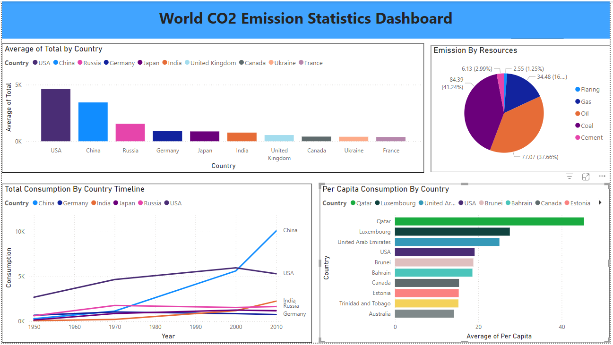

# Global CO2 Emission Analysis 

### Overview
This project demonstrates **Data Cleaning, Analysis, and Visualization** using a global CO2 emissions dataset. The project aims to explore CO2 emission patterns by country and per capita to identify trends and gain insights about the overall environmental scenario. The dataset was cleaned, analyzed, and visualized using SQL, Tableau, and Power BI, providing a comprehensive understanding of global CO2 emissions.

- **The Dataset** was acquired from [Kaggle](https://www.kaggle.com/datasets/thedevastator/global-fossil-co2-emissions-by-country-2002-2022).
- **Data Cleaning** was performed in Microsoft SQL Server using SQL queries to remove inconsistencies and transform the dataset into a usable format.
- **Data Analysis** focused on identifying trends in CO2 emissions by country and per capita.
- **Data Visualization** was done using **Tableau** and **Power BI**, providing interactive reports to explore the findings.

## Project Files
- **CO2 Emission Raw Dataset.xlsx**: The raw dataset obtained from Kaggle, containing information about CO2 emissions by country and year.
- **Emission Cleaned Dataset.csv**: The cleaned version of the dataset, generated after performing necessary SQL queries (in CSV format).
- **CO2 Emission PowerBI Visualization.pbix**: Power BI report file containing visualizations and interactive dashboards to explore the dataset.
- **CO2 Emission Tableau Visualization.twb**: Tableau report summarizing the findings with intuitive maps and charts for easy interpretation of the results.
- **CO2 Emission - SQL Query.sql**: SQL queries used to clean and transform the raw dataset, making it ready for analysis and visualization.

## How to Use
### To execute the SQL queries:
1. Use any SQL editor (e.g., MySQL, PostgreSQL, Microsoft SQL Server).
2. Run the **CO2 Emission - SQL Query.sql** file to transform the raw dataset into a cleaned dataset. This will handle data cleaning tasks such as filtering, aggregating, and formatting.

### To run the Tableau report locally:
1. Download and install **Tableau Desktop** from [here](https://www.tableau.com/products/desktop).
2. Download the **CO2 Emission Tableau Visualization.twb** file.
3. Open the file in Tableau Desktop and explore the interactive visualizations.

### To view the Power BI report:
1. Download and install **Power BI Desktop** from [here](https://powerbi.microsoft.com/desktop/).
2. Open the **CO2 Emission PowerBI Visualization.pbix** file in Power BI Desktop.
3. Interact with the visualizations and explore insights on emissions by country, year, and other variables.
4. Use slicers and filters to customize your analysis (e.g., filter by country, year, or emission type).

## Data Source
- The data used in this project is sourced from [Kaggle](https://www.kaggle.com/datasets/thedevastator/global-fossil-co2-emissions-by-country-2002-2022).
- The dataset includes the following fields:
  - **Country**: The country name.
  - **Year**: The year of emission data.
  - **Total Emission**: The total CO2 emissions in million metric tons.
  - **Emission Per Capita**: CO2 emissions per capita (in tons).
  - **Emissions by Type**: Breakdown of emissions from coal, oil, gas, etc.

## Visualizations
This project includes several visualizations to explore and present the findings:
- **Pie Chart**: Displays the distribution of CO2 emissions by country, allowing for easy identification of top emitters.
- **Bar Chart**: Shows the total CO2 emissions by country for a selected year.
- **Line Chart**: Illustrates the trends in CO2 emissions from 1950 to 2021, highlighting significant changes over time.

## Key Insights
- **Top CO2 Emitters**: Countries like **China**, **United States**, and **India** are among the largest contributors to global CO2 emissions.
- **Per Capita Emissions**: Some countries with smaller populations, such as **Qatar** and **Kuwait**, have disproportionately high per capita emissions, highlighting the need for targeted emission reduction strategies.
- **Trends Over Time**: Over the decades, global CO2 emissions have seen sharp increases, especially after 2000, largely driven by industrialization and energy consumption in emerging economies.

## Requirements
To use this project, the following software tools are required:
- **Microsoft SQL Server** for executing the SQL queries and data cleaning process.
- **Tableau Desktop** for visualizing and exploring the data through interactive charts and maps.
- **Power BI Desktop** for creating and viewing the Power BI dashboard and reports.

## Visualization in PowerBI

